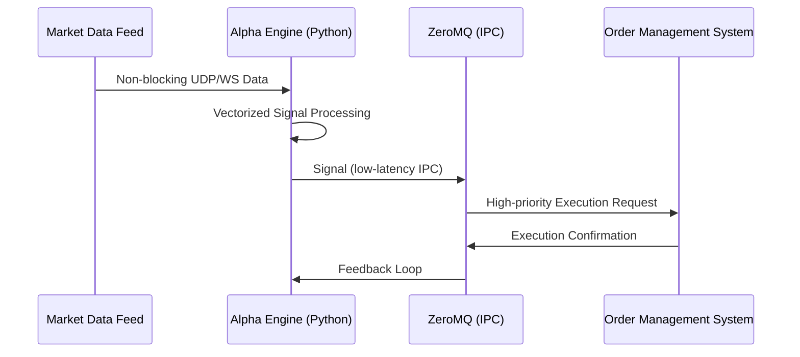

# 🐋 Whale Rider V4 - Core Architecture

## 1. Engine Design
Whale Rider is an Asynchronous High-Frequency Trading (HFT) system built with **Python 3.12** and **ZeroMQ**.

## 2. Key Modules
- **Alpha Engine**: Vectorized data processing using NumPy/Pandas for sub-millisecond signal generation.
- **ZeroMQ Pipeline**: Multicast/Unary communication patterns for decoupled inter-process communication.
- **Circuit Breakers**: Real-time risk management that halts execution if latency or slippage thresholds are breached.

## 3. Deployment Matrix
- **Runtime**: Docker Optimized (Slim Debian).
- **Network**: Kernel bypass tuning recommended for production environments.
- **Monitoring**: Prometheus/Grafana integration for real-time observability.
